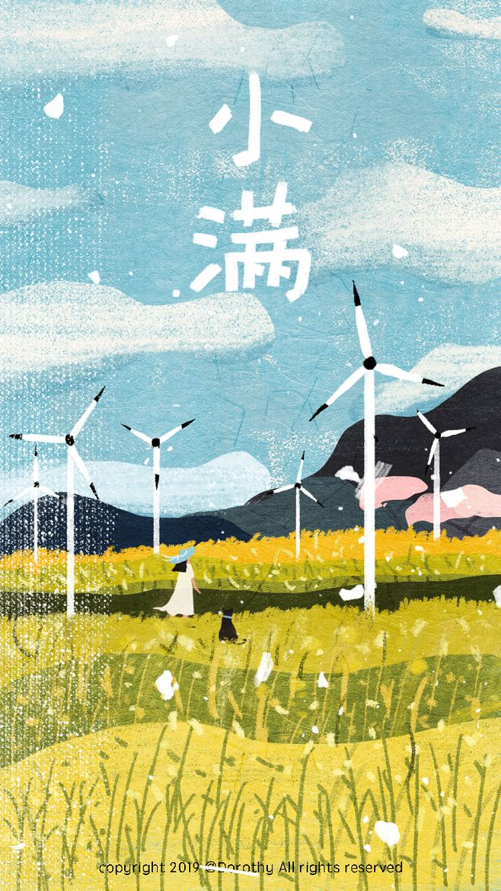

# 初始化标题

## 文字内容

```text
个话费国防生的
```

> 范德萨发



| 发大水 | 范德萨 |
| :--- | :--- |
| 发大水 | 范德萨 |


发大水








 范德萨



 范德萨






 










```
发大水
```







放大



范德萨



$$
a === b ?  true : false
$$



~~\`\`~~[~~`fdsa`~~](http://www.baidu.com)😁

